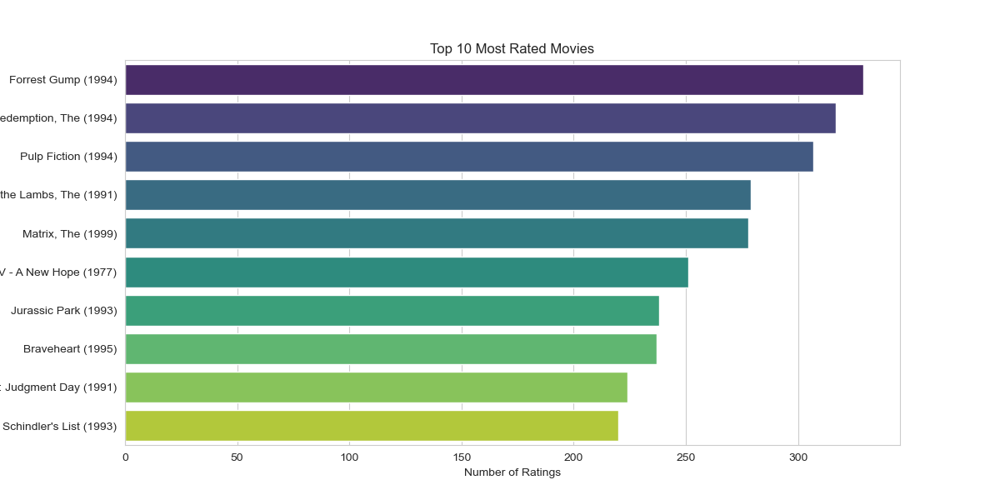

## Movie Recommender System


```Recommend top 5 movies for a specific user based on their ratings and preferences.```


Table of contents
===============
- [Business Understanding](#Business-Understanding:)
- [Data Understanding](#Data-Understanding:)
- [Data Preprocessing](#Data-Cleaning:)
- [Exploratory Data Analysis](#Exploratory-Data-Analysis)
- [Generating a Recommendation System](#Generating-the-Recommender-System)
- [Conclusion and Recommendation](#Conclusion-and-Recommendation:)

## Overview


**Project Objective:**
The objective of this project is to develop a movie recommendation system that tailors suggestions to individual users, taking into account their past viewing habits and preferences. The system utilizes a combination of collaborative and content-based filtering methods to improve the precision and pertinence of the movie recommendations.

**Key Components:**

The user's selected code describes the initial steps in a data analysis process for a movie recommendation system. Here's how you might implement these steps in Python:

1. **Data Collection:**
    - Load the dataset: You can use pandas' `read_csv` function to load the dataset. The dataset is assumed to be in CSV format and contains columns for movies, genres, user ratings, and tags.
    - Clean the dataset: This could involve a variety of steps, including removing duplicates, handling missing values, and converting data types. The exact steps will depend on what the data looks like.

2. **Exploratory Data Analysis (EDA):**
    - Analyze the dataset: Use functions like `describe()`, `info()`, and `value_counts()` to understand the structure, features, and distributions of the data.
    - Visualize key patterns: You can use libraries like matplotlib and seaborn to create visualizations that help you understand user preferences and movie popularity.

I  Explored 3 different approaches to building a movie recommendation system:

1. **Content-Based Filtering:**
    - Implement a content-based recommender system: This involves creating a matrix of item features (in this case, movie genres), and then calculating the similarity between items based on these features.
    - Use TF-IDF vectors to represent movie content: The `TfidfVectorizer` class from the sklearn.feature_extraction.text module can be used to convert the genre data into a matrix of TF-IDF features. Then, you can use cosine similarity to calculate the similarity between different movies.

2. **Neighborhood-Based Collaborative Filtering (KNN):** This approach uses the K-Nearest Neighbors algorithm from the SciKit Learn library. It explores both user-based and item-based collaborative filtering approaches. The performance of the model is evaluated using metrics such as Root Mean Square Error (RMSE) and Mean Absolute Error (MAE).

3. **Model-Based Collaborative Filtering (SVD):** This approach uses the Singular Value Decomposition (SVD) algorithm from the Surprise library. The performance of the model is evaluated and hyperparameters are tuned for optimal results.s approach combines the strengths of content-based and collaborative filtering approaches. It leverages both user-item interactions and content features to provide recommendations.

Recap:
```python
from sklearn.neighbors import NearestNeighbors
from surprise import SVD, Dataset, Reader, accuracy
from surprise.model_selection import cross_validate, train_test_split
#KNN Model
knn = NearestNeighbors(metric='cosine', algorithm='brute')
knn.fit(data)
# SVD Model
reader = Reader(rating_scale=(1, 5))
data = Dataset.load_from_df(data[['userId', 'movieId', 'rating']], reader)
trainset, testset = train_test_split(data, test_size=.25)

svd = SVD()
svd.fit(trainset)
predictions = svd.test(testset)
# Measure
accuracy.rmse(predictions)
```

Business Understanding:
=======

Objective:
-------------
The main goal of this project is to boost user engagement and satisfaction on the MovieLens platform by providing personalized and relevant movie recommendations. The recommender system is designed to offer customized suggestions to users based on their historical movie ratings and tagging activities, thereby enhancing their overall user experience.

Scope:
-------------
The project will concentrate on the development of a recommender system based on collaborative filtering, utilizing the ml-latest-small dataset from MovieLens. The recommendations will be user-centric, ensuring that users discover movies that align with their tastes and interests. The project scope encompasses both explicit ratings and user-generated tags as significant indicators of user preferences.

Success Criteria:
-------------
The effectiveness of the recommender system will be assessed based on several key performance indicators (KPIs):
-  User Engagement:
   An increase in the number of user interactions with the platform, including ratings, tags, and time spent on the website.
- Recommendation Accuracy:
  Enhancement in the precision and relevance of movie recommendations, reducing instances of irrelevant or disliked suggestions.
- User Satisfaction:
  Positive user feedback, gauged through surveys, reviews, and user ratings.
-  Platform Adoption:
   Increase in the number of registered users and active users utilizing the recommendation features.
### Project Structure

The project is organized as follows:

**1. Webapp - Deployment:**

- **models:** This directory stores pre-trained models used for recommendations:
  - `knn.pickle`: Serialized KNN model.
  - `NMF_model.pickle` & `NMF_R.pickle`: Components of the NMF model.
- **static:** Contains CSS files for website styling: `styles.css`.
- **templates:** Stores HTML templates for the web application:
  - `knn_recommender.html`, `main_knn.html`, `main.html`, `recommender.html`.
- **app.py:**  The core Flask application file that defines routes, user input handling, and recommendation generation calls.
- **recommending_engine.py:**  Contains the NMF recommendation engine code, including a function to update the model with new data.
- **knn_recommending_engine.py:**  Provides KNN-based movie recommendations based on a given movie.

**2. Data:**

- **raw:** Contains the raw MovieLens dataset, including:
  - `links.csv`, `movies.csv`, `ratings.csv`, `tags.csv`.
  - `README.txt`: Provides information about the data content.
- **preprocessed:** Stores the final processed data after merging and imputing missing values: `df_final.csv`.

**3. Additional Files:**

- **MICE_imputer.py:** Implements the MICE (Multivariate Imputation by Chained Equations) model used to handle missing values in the dataset.
- **requirements.txt:** Lists the required Python packages for running the project.

## Getting Started

1. **Clone the Repository:**
   ```bash
   git clone https://github.com/yourusername/movierecommender.git
   ```
2. **Navigate to the Project Directory:**
   ```bash
   cd movierecommender
   ```
3. **Install Dependencies:**
   ```bash
   pip install -r requirements.txt
   ```
4. **Run the application:**
   ```bash
   python app.py
   ```
   This will launch the application accessible at `http://localhost:5050` in your web browser.

## Testing the Recommendation Engine Video - Webapp 


## Built-in Machine Learning Techniques

* **Matrix Factorization:** This technique decomposes a large matrix (user-item rating matrix) into smaller, denser matrices that capture underlying features (latent factors) influencing user-item interactions. NMF, a specific type of matrix factorization, uses non-negative values to represent these latent factors, providing interpretable insights into user preferences.

* **K-Nearest Neighbors (KNN):**  This is a supervised machine learning algorithm for both classification and regression tasks.  In recommender systems, it's often used for collaborative filtering. Here, the KNN algorithm identifies the k most similar movies (based on user ratings or other data points) to a user's chosen movie, using cosine similarity as the distance metric. Cosine similarity measures the similarity between items by calculating the cosine of the angle between their vector representations in a multidimensional space.

## Conclusion - think of this scenario 
Streaming Service: movielens
Random Movies:  (1) The Princess Bride (Comedy/Adventure), (2) Parasite (Thriller/Drama), (3) The Shawshank Redemption (Drama/Crime)
Ratings: (1) The Princess Bride - 5 stars, (2) Parasite - 4 stars, (3) The Shawshank Redemption - 5 stars

```bash
Based on your high ratings of:
The Princess Bride and The Shawshank Redemption,
you might enjoy other classic adventure comedies like 
"Monty Python and the Holy Grail" or "Raiders of the Lost Ark."
You could also explore other critically acclaimed prison dramas like "Brubaker" or "A Prophet."
Even though Parasite received a 4-star rating, its unique genre-bending style might 

lead you to explore other Korean thrillers like "Burning" or "Oldboy."
```


---

## Conclusion and Recommendations 

---
In my journey to develop a movie recommender system, I delved into multiple strategies, each with distinct advantages and limitations.

Here's a comprehensive overview of my exploration:

**Content-Based Filtering:**
I constructed a content-based recommender by leveraging movie attributes like genres. This approach excelled in suggesting similar movies based on content similarities. However, it may struggle with capturing diverse user preferences and recommending outside the established content boundaries.

**Neighborhood-Based Collaborative Filtering (KNN):**
Implementing KNN models using SciKit Learn, I tapped into user-item interactions to drive recommendations. The item-based variant, utilizing cosine similarity, showcased notable effectiveness in identifying analogous movies, enriching the user experience.

**Model-Based Collaborative Filtering (SVD):**
My experimentation extended to the Surprise library, where I employed SVD, a matrix factorization method. While SVD demonstrated reasonable performance with an RMSE of 0.8925, its efficacy hinged on fine-tuned hyperparameters and meticulous model assessment.

**Recommendation Strategy:**
Considering the nuanced trade-offs inherent in each method, I advocate for a hybrid model amalgamating content-based and collaborative filtering. This hybrid framework can harness the granular user-item interactions from collaborative filtering while integrating content cues for enhanced personalization and diversity in recommendations.

Furthermore, I propose ongoing hyperparameter optimization and model refinement, particularly with larger datasets, to augment the predictive power of collaborative filtering techniques. Continual feedback integration from users and dynamic content updates will further fortify the recommendation engine's efficacy and relevance over time.

In essence, the optimal recommender system choice hinges on specific use-case nuances, user dynamics, and dataset intricacies. A meticulously curated hybrid model, iteratively honed and validated, stands poised to deliver robust, accurate, and adaptive movie recommendations, aligning seamlessly with evolving user preferences and content landscape dynamics.

---


---

In my opinion which movies should consider exploring? 😊 ?



Data Source and Acknowledgements: [MovieLens Dataset](https://grouplens.org/datasets/movielens/) 🙏🏿