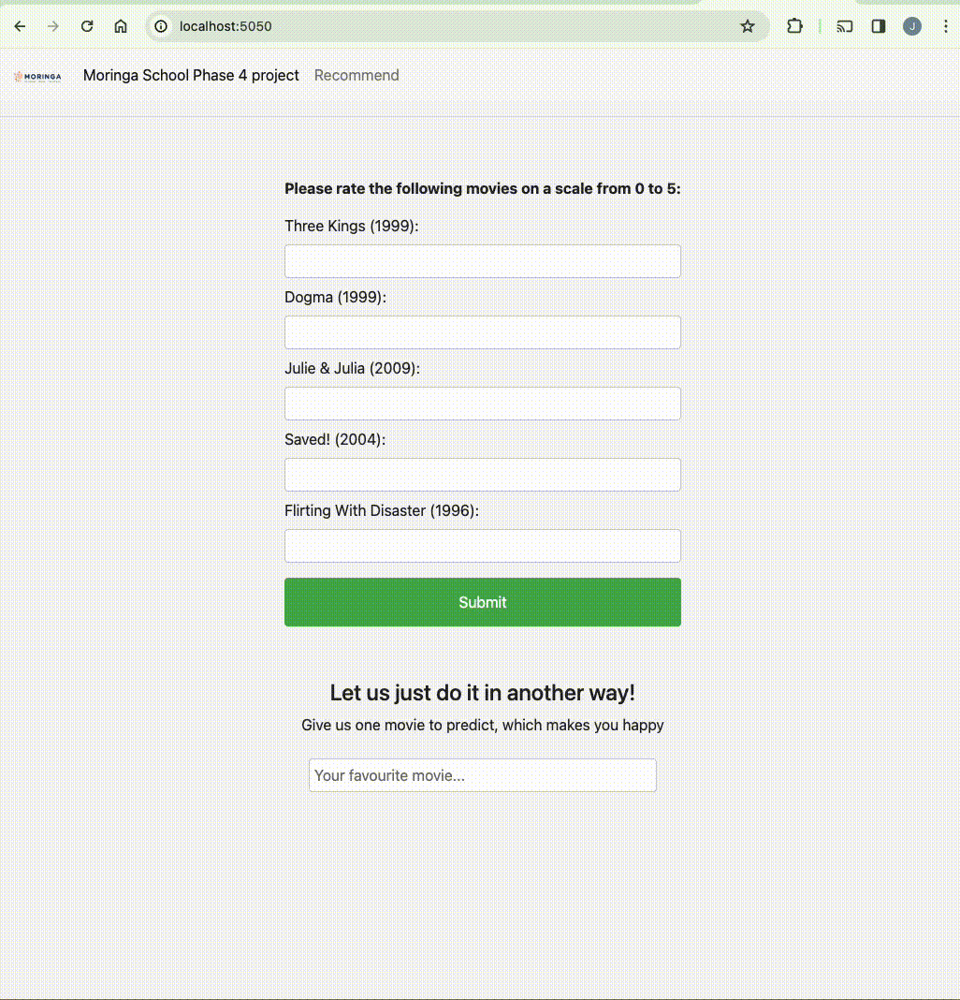

## Movie Recommender System


```Recommend top 5 movies for a specific user based on their ratings and preferences.```

### Project: A Movie Recommendation System with NMF and KNN

This project implements a movie recommender website built with Python's Flask framework and leverages machine learning algorithms to suggest movies to users. It offers two recommendation engines, each employing a different technique:

- **Collaborative Filtering with Non-negative Matrix Factorization (NMF):** This collaborative filtering approach decomposes the user-item rating matrix into two lower-dimensional matrices, capturing latent factors that influence user preferences. By analyzing these latent factors, the model recommends movies similar to those a user has enjoyed in the past.

- **Item-based Collaborative Filtering with K-Nearest Neighbors (KNN):** This method focuses on item similarity.  Here, the KNN algorithm identifies movies most similar (based on cosine similarity) to a user's selection.  Cosine similarity measures the similarity between items based on the user ratings they've received.

### Project Structure

The project is organized as follows:

**1. Webapp:**

- **models:** This directory stores pre-trained models used for recommendations:
  - `knn.pickle`: Serialized KNN model.
  - `NMF_model.pickle` & `NMF_R.pickle`: Components of the NMF model.
- **static:** Contains CSS files for website styling: `styles.css`.
- **templates:** Stores HTML templates for the web application:
  - `knn_recommender.html`, `main_knn.html`, `main.html`, `recommender.html`.
- **app.py:**  The core Flask application file that defines routes, user input handling, and recommendation generation calls.
- **recommending_engine.py:**  Contains the NMF recommendation engine code, including a function to update the model with new data.
- **knn_recommending_engine.py:**  Provides KNN-based movie recommendations based on a given movie.

**2. Data:**

- **raw:** Contains the raw MovieLens dataset, including:
  - `links.csv`, `movies.csv`, `ratings.csv`, `tags.csv`.
  - `README.txt`: Provides information about the data content.
- **preprocessed:** Stores the final processed data after merging and imputing missing values: `df_final.csv`.

**3. Additional Files:**

- **MICE_imputer.py:** Implements the MICE (Multivariate Imputation by Chained Equations) model used to handle missing values in the dataset.
- **requirements.txt:** Lists the required Python packages for running the project.

## Getting Started

1. **Clone the Repository:**
   ```bash
   git clone https://github.com/yourusername/movierecommender.git
   ```
2. **Navigate to the Project Directory:**
   ```bash
   cd movierecommender
   ```
3. **Install Dependencies:**
   ```bash
   pip install -r requirements.txt
   ```
4. **Run the application:**
   ```bash
   python app.py
   ```
   This will launch the application accessible at `http://localhost:5050` in your web browser.

## Testing the Recommendation Engine Video  


## Built-in Machine Learning Techniques

* **Matrix Factorization:** This technique decomposes a large matrix (user-item rating matrix) into smaller, denser matrices that capture underlying features (latent factors) influencing user-item interactions. NMF, a specific type of matrix factorization, uses non-negative values to represent these latent factors, providing interpretable insights into user preferences.

* **K-Nearest Neighbors (KNN):**  This is a supervised machine learning algorithm for both classification and regression tasks.  In recommender systems, it's often used for collaborative filtering. Here, the KNN algorithm identifies the k most similar movies (based on user ratings or other data points) to a user's chosen movie, using cosine similarity as the distance metric. Cosine similarity measures the similarity between items by calculating the cosine of the angle between their vector representations in a multidimensional space.

## Conclusion - think of this scenario 
Streaming Service: movielens
Random Movies:  (1) The Princess Bride (Comedy/Adventure), (2) Parasite (Thriller/Drama), (3) The Shawshank Redemption (Drama/Crime)
Ratings: (1) The Princess Bride - 5 stars, (2) Parasite - 4 stars, (3) The Shawshank Redemption - 5 stars

```bash
Based on your high ratings of:
The Princess Bride and The Shawshank Redemption,
you might enjoy other classic adventure comedies like 
"Monty Python and the Holy Grail" or "Raiders of the Lost Ark."
You could also explore other critically acclaimed prison dramas like "Brubaker" or "A Prophet."
Even though Parasite received a 4-star rating, its unique genre-bending style might 

lead you to explore other Korean thrillers like "Burning" or "Oldboy."
```


---

## Recommendations - Future Work

---
### Contextual Recommendations:

- Time-based recommendations for different days and times.
- Location-based suggestions for travelers.
- Mood-based recommendations based on user sentiment analysis.
- Watch history analysis for personalized suggestions.

### Social Integration:

- Friend recommendations based on shared interests.
- Shared lists for collaborative movie discovery.
- Discussion forums for user interaction and recommendation sharing.

### Multi-Modal Recommendations:

- User review analysis for sentiment-based recommendations.
- Trailer view tracking for upcoming movie suggestions.
- Audio/visual data utilization for recommending movies with similar styles.

### Dynamic Personalization:

- Real-time updates to user profiles for evolving preferences.
- Machine learning algorithms for continuous refinement of recommendations.

### Hybrid Models:

- Combination of collaborative filtering and content-based filtering.
- Integration of contextual information for enhanced recommendation accuracy.

### Enhanced UI/UX:

- Intuitive search tools with advanced filters.
- Personalized collections for users to curate their favorite movies.
- Seamless browsing experience across devices.

### Ethical Considerations:

- Bias prevention mechanisms to ensure fair recommendations.
- Diverse recommendations catering to various tastes and preferences.
- Data transparency for user control over data usage.


---
Data Source and Acknowledgements: [MovieLens Dataset](https://grouplens.org/datasets/movielens/) 